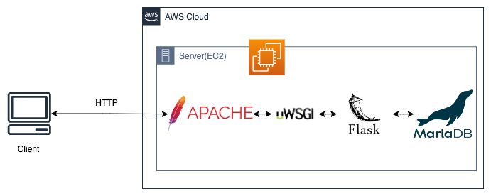

# FlaskWebApplicationSample
AWS EC2上で簡単な在庫管理システム的なものを勉強用に作ってみる。

## アーキテクチャ

 

WebサーバがAPサーバ、DBも兼ねる形。

ApacheがHTTPリクエストをWSGIに渡し、
WSGIがFlaskで記述したAPIを呼び出す。

そして、APIがDBを操作する。

## ファイル構成

- /var/www/html/v1

        api.py  
        api.wsgi

- /etc/httpd/conf

       httpd.conf
